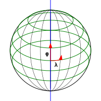
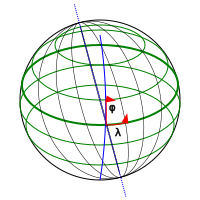

So I've been getting back into a bit of physics, and decided to take a crack at general relativity and tensor calculus. It's all derivatives, right, so it should be easy? Well, of course, I'm having trouble. One major sticking point is the notion of a dual basis. I understand the definition but couldn't make it click into a substantive understanding. This is my attempt to start working it out.

Seems to be a rite of long passage.

<!-- more -->

## Reading List

Reading different texts for different insights:

* [A Student's Guide to Vectors and Tensors](http://www4.danfleisch.com/sgvt/)
* [A First Course in General Relativity](https://www.cambridge.org/highereducation/books/a-first-course-in-general-relativity/933C1A8C84420EF1349B676F0D70A065#overview)
* [Mathematical Methods for Physics and Engineering](https://www.cambridge.org/core/books/mathematical-methods-for-physics-and-engineering/911A43AE1CF224743D32707FCC4AE0EB)
* [The Meaning of Relativity](https://lectures.princeton.edu/sites/g/files/toruqf296/files/2020-08/_Albert_Einstein__Brian_Greene__The_meaning_of_rel_BookZZ.org_.pdf)

## The Goal

The general idea, as I understand it, is to "do calculus" in a way that is independent of the coordinate system you choose. You do this by expressing your mathematics in a way that works for any coordinate system so that you can ensure the rules are, in fact, independent of your choice.

There are a series of mathematical abstractions at work here. I'm going to try to take a path through those with a concrete example. Along the way, there will be places where I'm assuming more than we need to or skipping some complications. Those can be of interest mathematically but also of scientific significance, so I'll try to note those according to my current understanding.

## A Tale of Two Coordinate Systems

Let's work with a concrete example that is simple enough (hopefully) to calculate explicitly and complicated enough (hopefully) to show some of the complexities that tensor calculus can handle.

We will take as our example the surface of a sphere, embedded in 3-dimensional space: center at the origin, radius 1. We will examine two coordinate systems:

* The [Geographic Coordinate System](https://en.wikipedia.org/wiki/Geographic_coordinate_system) with standard latitude and longitude.
* A coordinate system with longitude as usual, but with longitudes not through the North Pole but through the [Geomagnetic Pole](https://en.wikipedia.org/wiki/Geomagnetic_pole), which is about 9.6° away from the North Pole.

### Geographic Spherical Coordinates

The standard coordinate system for the surface of a sphere is [latitude and longitude](https://en.wikipedia.org/wiki/Geographic_coordinate_system).

* Latitude φ
* Longitude λ

### Geomagnetic Spherical Coordinates

We use a coordinate system just complicated enough to be non-orthogonal: latitudes as usual, but longitudes not through the North Pole but through the [Geomagnetic Pole](https://en.wikipedia.org/wiki/Geomagnetic_pole), which is about 9.6° away from the North Pole.

# Next Up

Next up will be "The Tangent Space"