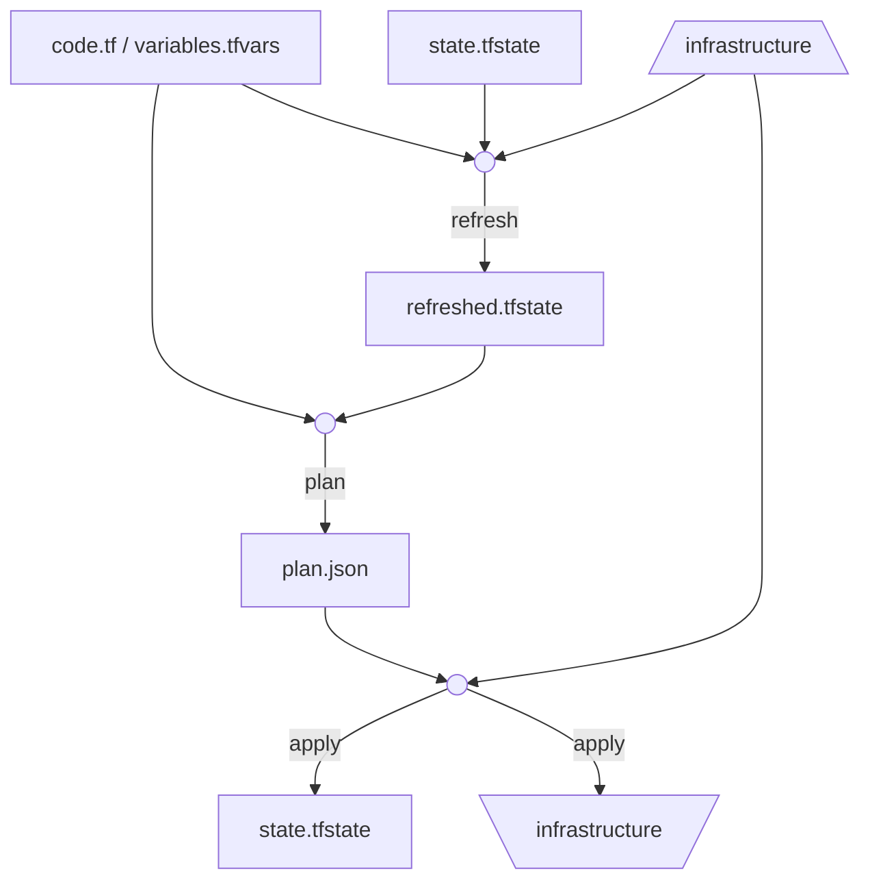

We use [Terraform](https://www.terraform.io/) a lot at my work. There's been an interesting learning curve as I've gone from no knowledge of it, to using it in production. I had a bit of trouble figuring out a conceptual model - a way of thinking about what it was doing - that worked for me.

Eventually I found one.

<!-- more -->

## What Terraform is

Terraform configurations are written in [HCL](https://github.com/hashicorp/hcl) which is

> a specialized language for our tools, and JSON as the interoperability layer.

HCL provides significant templating functionality, and syntactic sugar - but to understand what the configuration will actually do, you should think of it as JSON. Specifically, think of it in terms of a set of deeply nested objects, with key -> value a.b.c.f -> config. The meaning of the config comes from the keys, and the value. 

## What Terraform does

Schematically, here's what happens when you use terraform:

$$\operatorname{T}(state, code; infrastructure) \rightarrow (state', infrastructure')$$

The tricky part for me to understand here is the role of the `tf.state` file. It's the mysterious file that's always being 'refreshed', and sometimes (or before you get the hang of things, maybe more than sometimes) gets corrupt and needs you to mess around to [recover it](https://medium.com/@abtreece/recovering-terraform-state-69c9966db71e).

But `tf.state` is the key to understanding what terraform is doing. Basically, it's just taking `tf.state`, applying a program (defined by your `.tf` files), and updating to a new `tf.state`. What happens to your infrastructure is just a happy side effect. This is I think a weakness of the terraform model - that you have two sources of truth - the state file, and the actual infrastructure. I wonder if for AWS at least, you could tag the infrastructure terraform created with enough metadata so that you could get rid of `tf.state`.

